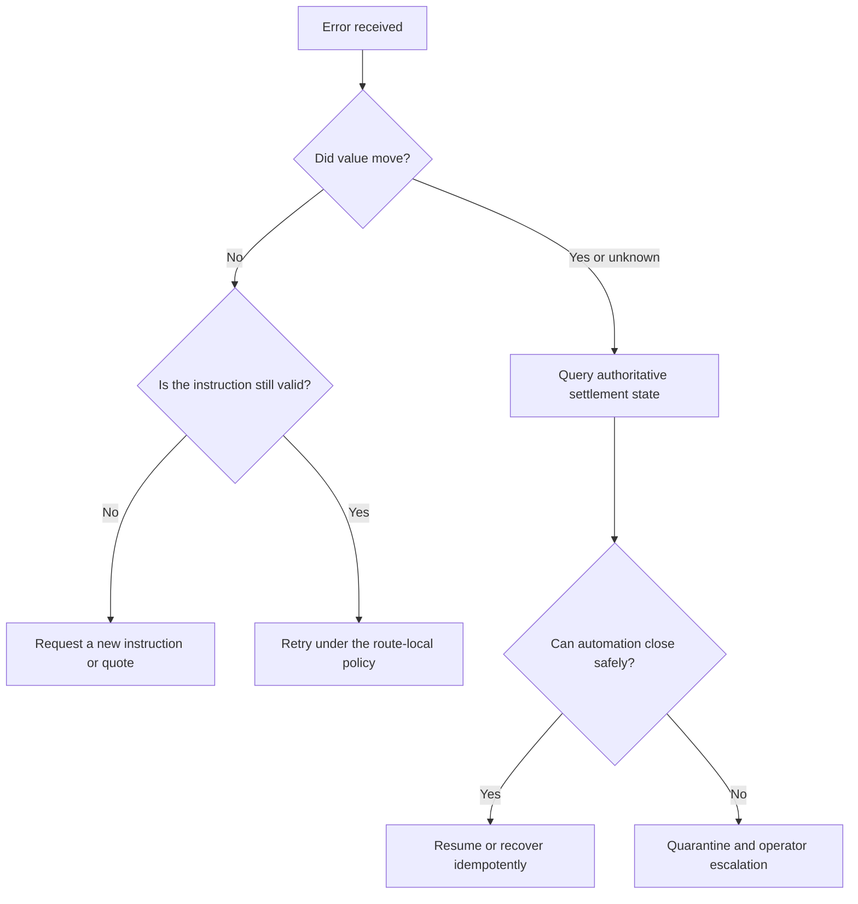

# Failure is part of the settlement lifecycle

A settlement integration is incomplete if it documents only the successful submission path.

SW4P must distinguish where the instruction failed, whether value moved, which actor may retry or recover, and what evidence closes the failure.

## Failure classes

| Class | Example | Value moved? | Default disposition |
|---|---|---:|---|
| **Instruction rejection** | invalid recipient, amount, asset, or policy | No | correct the instruction; do not retry unchanged |
| **Authorization failure** | missing, invalid, expired, replayed, or unauthorized approval | No | obtain valid authority; do not mutate around the policy |
| **Quote expiry** | route, fee, gas, limit, or capacity changed | No | request a new quote |
| **Source execution failure** | source transaction reverted or was rejected | Usually no | inspect route-local error and retry only when allowed |
| **Source finality without destination completion** | burn, lock, or debit finalized but destination did not complete | Yes | enter the route-local recovery, attestation, relay, refund, or escalation path |
| **Duplicate or replayed instruction** | the client resubmitted an existing idempotent request | Maybe | return or resume the existing settlement state |
| **Status transport failure** | webhook, callback, SSE, polling, or client connection failed | Unknown | query the authoritative settlement state; do not infer transaction failure from notification failure |
| **Reconciliation mismatch** | chain receipt, provider record, fee record, or ledger does not agree | Yes or unknown | quarantine the close and require evidence review |

## Retry policy

A retry is allowed only when the current state makes it safe.

Do not implement a generic exponential-backoff loop around externally consequential writes without:

- an idempotency key;
- state lookup before retry;
- route-local duplicate protection;
- a maximum attempt and timeout policy;
- explicit handling for value-already-moved states.

## Client responsibilities

An integrating application should preserve:

- its own instruction or order identifier;
- the SW4P settlement identifier returned by the accepted contract;
- the quote and policy version;
- authorization evidence;
- last authoritative state;
- final receipt and reconciliation record;
- user-visible recovery instructions where required.

## SW4P responsibilities

The admitted implementation contract should define:

- stable machine error codes;
- whether the error is retryable;
- whether value may have moved;
- the next safe client action;
- the state-query path;
- the recovery or refund path;
- the evidence returned when the failure closes.

<Warning>
The previous public page named SDK error classes and automatic retry options that were not reconciled against an admitted public SDK. Those names are not part of the current public contract.
</Warning>

## Production acceptance

A route should not be considered production-ready until its test corpus covers:

- malformed and unauthorized instructions;
- duplicate requests;
- expired quotes;
- provider and RPC failure;
- source-only completion;
- destination delay;
- recovery and refund;
- notification loss;
- reconciliation mismatch;
- operator escalation and evidence close.

<Card title="Integration readiness" icon="clipboard-check" href="/quickstart">
  Define the failure states and production decision for one real settlement workflow.
</Card>
