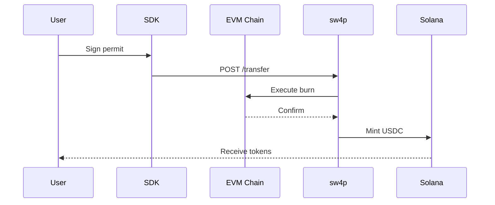

## Overview

Transfer USDC from Ethereum, Base, Arbitrum, or Polygon to Solana.



## Step-by-Step

<Steps>
  <Step title="Estimate Fees">
    ```typescript
    const estimate = await bridge.estimateFee({
      from: 'BASE',
      to: 'SOLANA',
      amount: '100.00'
    })
    ```
  </Step>

  <Step title="Sign Permit">
    ```typescript
    const permitData = bridge.createPermitTypedData({
      chain: 'BASE',
      owner: userAddress,
      spender: BRIDGE_SPENDER,
      value: parseUnits('100', 6),
      nonce: await getNonce()
    })
    
    const signature = await signTypedData(permitData)
    ```
  </Step>

  <Step title="Execute Transfer">
    ```typescript
    const result = await bridge.transfer({
      from: 'BASE',
      to: 'SOLANA',
      amount: '100.00',
      recipient: 'YOUR_SOLANA_ADDRESS',
      permit: parseSignature(signature)
    })
    ```
  </Step>

  <Step title="Track Status">
    ```typescript
    const status = await bridge.getStatus(result.intentId)
    ```
  </Step>
</Steps>
