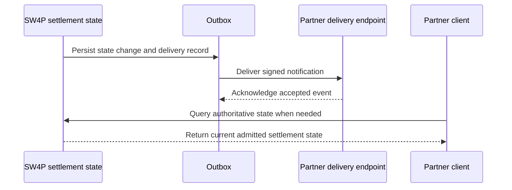

# Notifications report state; they do not define it

A webhook, callback, stream, or polling response is a transport for settlement state.

The authoritative state remains the admitted settlement record and its chain, provider, proof, recovery, and reconciliation evidence.

A lost notification does not necessarily mean the settlement failed. A delivered notification does not by itself prove finality.

## Required notification properties

A production notification contract should define:

- event identifier;
- settlement identifier;
- event type and state version;
- environment and route identifier;
- event creation time;
- current settlement state;
- source and destination evidence references where available;
- policy or schema version;
- signature or message-authentication method;
- retry and retention policy.

## Delivery model

The settlement mutation and the outbox or delivery record should be committed atomically or through a design that cannot silently lose the notification obligation.

## Receiver requirements

A receiver should:

1. authenticate the notification using the current published scheme;
2. reject unsupported schema or policy versions;
3. deduplicate by event identifier;
4. order or reconcile events by settlement and state version;
5. acknowledge only after durable acceptance;
6. query the authoritative state when delivery is delayed, duplicated, or out of order;
7. preserve the final receipt and reconciliation reference.

## Security requirements

The admitted public contract must specify:

- key discovery and rotation;
- signature algorithm and canonical payload encoding;
- replay window or nonce treatment;
- endpoint allowlisting or authentication where applicable;
- secret and key storage requirements;
- revocation and incident procedure;
- test vectors.

<Warning>
The previous page published a `webhookUrl` request field, an `X-Sw4p-Signature` header, and a simple HMAC example without an admitted implementation-derived contract. Those identifiers are not part of the current public API promise.
</Warning>

## Event taxonomy

The final generated reference may expose events corresponding to states such as:

- instruction accepted;
- quote expired or replaced;
- authorization accepted or rejected;
- source execution submitted or finalized;
- destination completion pending or finalized;
- recovery required or completed;
- refund completed;
- reconciliation admitted or quarantined.

The actual event names and payload fields belong to the generated developer contract.

## Delivery failure

SW4P and the partner must define:

- retry schedule and maximum delivery horizon;
- dead-letter or quarantine behavior;
- partner re-delivery request;
- state-query fallback;
- operator escalation;
- evidence retained after delivery expires.

<Card title="Failure and recovery" icon="life-ring" href="/guides/error-handling">
  Understand why notification loss and settlement failure are separate states.
</Card>
