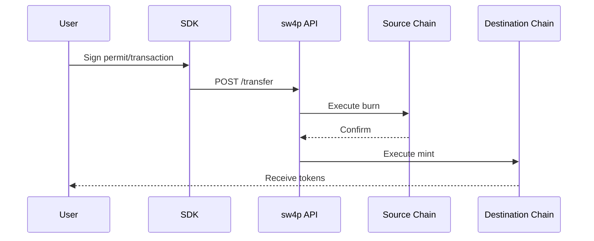

## Welcome to sw4p

sw4p enables **gasless cross-chain transfers** across any blockchain. Users sign permits or transactions with their wallet, and sw4p handles all bridging infrastructure.

<CardGroup cols={2}>
  <Card title="Quick Start" icon="rocket" href="/quickstart">
    Get started in under 5 minutes
  </Card>
  <Card title="TypeScript SDK" icon="js" href="/sdks/typescript">
    npm install @sw4p/bridge
  </Card>
  <Card title="Rust SDK" icon="rust" href="/sdks/rust">
    cargo add sw4p-bridge
  </Card>
  <Card title="API Reference" icon="code" href="/api-reference/introduction">
    REST API documentation
  </Card>
</CardGroup>

## Vision

**Support every blockchain, every stablecoin, and every native token.**

Current MVP supports:
- **EVM Chains**: Ethereum, Base, Arbitrum, Polygon
- **Non-EVM**: Solana
- **Tokens**: USDC (more coming soon)

## Key Features

<AccordionGroup>
  <Accordion title="Gasless Transfers" icon="gas-pump">
    Users don't need native tokens for gas. sw4p sponsors gas costs through permit-based approvals.
  </Accordion>
  <Accordion title="Non-Custodial" icon="lock">
    SDKs never handle private keys. All signing happens in the user's wallet.
  </Accordion>
  <Accordion title="Fast" icon="bolt">
    Transfers complete in approximately 60 seconds across all supported routes.
  </Accordion>
  <Accordion title="Transparent Fees" icon="receipt">
    Know the exact cost before confirming. Fee estimates include all gas and bridge costs.
  </Accordion>
</AccordionGroup>

## How It Works

