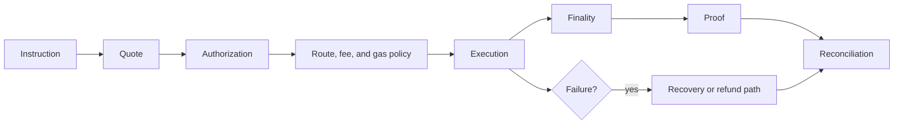

# One instruction for a finished settlement outcome

SW4P gives applications and agents one interface to **quote, execute, prove, recover, and reconcile** stablecoin settlement across supported routes.

The product begins with the outcome the application needs — not with a bridge catalogue.

A customer supplies the recipient, asset, amount, source and destination, fee policy, gas policy, finality requirement, and recovery policy. SW4P returns a quoted and tracked settlement state.

<CardGroup cols={2}>
  <Card title="Quick Start" icon="rocket" href="/quickstart">Submit the first settlement instruction.</Card>
  <Card title="TypeScript SDK" icon="js" href="/sdks/typescript">Integrate the typed client.</Card>
  <Card title="Rust SDK" icon="rust" href="/sdks/rust">Integrate from a Rust application.</Card>
  <Card title="API Reference" icon="code" href="/api-reference/introduction">Review the current interface.</Card>
</CardGroup>

## Settlement is a lifecycle

```mermaid
flowchart LR
    I[Instruction] --> Q[Quote]
    Q --> A[Authorization]
    A --> R[Route, fee, and gas policy]
    R --> E[Execution]
    E --> F[Finality]
    F --> P[Proof]
    P --> C[Reconciliation]
    E --> X{Failure?}
    X -- yes --> Y[Recovery or refund path]
    Y --> C
```

A submitted transaction is not enough. A product needs to know whether value landed, which policy applied, whether a failure is recoverable, and which receipt closes the instruction.

## What SW4P handles

<AccordionGroup>
  <Accordion title="Quote and route policy" icon="route">
    Select an admitted route, expose its limits, price its fee and gas treatment, and return the obligations before execution.
  </Accordion>
  <Accordion title="Authorization" icon="key">
    Bind the settlement instruction to the required wallet, account, signature, permit, or delegated authority.
  </Accordion>
  <Accordion title="Execution and finality" icon="arrows-rotate">
    Submit the route-local transaction, track its lifecycle, and distinguish source execution from destination finality.
  </Accordion>
  <Accordion title="Failure and recovery" icon="life-ring">
    Detect stalled or partial states, apply the route-local recovery or refund path, and stop safely when evidence is incomplete.
  </Accordion>
  <Accordion title="Proof and reconciliation" icon="receipt">
    Return the evidence and economic record required by the integrating application.
  </Accordion>
</AccordionGroup>

## Supported routes

Routes are admitted individually. The route registry — not this introduction — owns current availability.

Each public route row should identify:

- source and destination;
- asset;
- environment;
- route kind;
- minimum, maximum, and capacity constraints;
- fee and gas policy;
- liquidity or inventory dependency;
- recovery path;
- last accepted proof;
- source, qualification, deployment, activation, and production-proof state.

<Card title="Supported routes" icon="diagram-project" href="/supported-chains">
  Review the registry-backed route and environment table.
</Card>

<Warning>
Source code, a contract address, or a successful testnet transaction does not by itself make a public production route active.
</Warning>

## Gas is an economic policy

“Gasless” is not a universal free-gas promise.

An application may:

- sponsor gas as a product cost;
- recover gas through the disclosed fee policy;
- require a separate user payment;
- use a supported paymaster or facilitator;
- pre-fund a bounded route or programme budget.

The quote must expose the applicable treatment before execution.

## Current state

<Info>
**DEPLOYING:** SW4P source and route evidence exist. Public availability is bounded route by route and must be read from the admitted route registry.
</Info>

Documentation must not use evergreen claims for:

- fixed chain counts;
- fixed settlement speed;
- uptime;
- settlements per day;
- test totals;
- route coverage;
- future rails.

## $555 boundary

SW4P settles through USDC and other approved route assets.

$555 may support selected access, fee-credit, liquidity, bond, or governance roles only when activated. It is not the default settlement principal, legal tender, equity, or a guaranteed-yield instrument.

## Design partnerships

SW4P is looking for applications that already need a real settlement workflow:

- wallet or embedded-wallet transfers;
- marketplace deposits, fees, and payouts;
- creator and media payments;
- treasury operations;
- token or application settlement;
- agent and x402-compatible payment flows.

Bring one live workflow, its current economic requirement, and the production decision the integration needs to reach.

<Card title="Propose a SW4P design partnership" icon="handshake" href="https://www.rndrntwrk.com/partners">
  Start with one bounded settlement outcome and the evidence required to accept it.
</Card>
