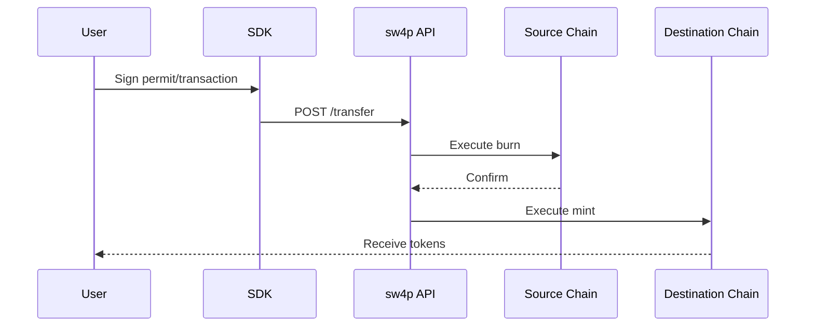

## What is SW4P?

SW4P is an intelligent routing and settlement system for moving value across the internet.

A payment, transfer or exchange starts with an intended outcome. SW4P selects a route and coordinates the authorisation, fees, gas and execution needed to carry it through settlement. It tracks what completed, what failed and what requires recovery.

These capabilities are programmable and composable. Software can call them directly and combine them across multiple steps, making value movement part of how an application operates.

<CardGroup cols={2}>
  <Card title="Quick Start" icon="rocket" href="/quickstart">
    Follow the setup and transfer guide
  </Card>
  <Card title="TypeScript SDK" icon="js" href="/sdks/typescript">
    Integrate SW4P in TypeScript
  </Card>
  <Card title="Rust SDK" icon="rust" href="/sdks/rust">
    Explore the Rust SDK
  </Card>
  <Card title="API Reference" icon="code" href="/api-reference/introduction">
    REST API documentation
  </Card>
</CardGroup>

## Value at the speed of thought

SW4P’s vision is to make moving value as natural as expressing intent. The ambition is dependable completion with less effort, cost and delay, wherever value needs to move.

## Key Features

<AccordionGroup>
  <Accordion title="Gas Abstraction" icon="gas-pump">
    Pay network fees in the asset you’re moving. SW4P handles the native gas required to execute the transaction.
  </Accordion>
  <Accordion title="Authorisation" icon="lock">
    Authorise the operation through the signing flow required by its route. The integration guide explains which permit or transaction to sign and how to submit it.
  </Accordion>
  <Accordion title="Settlement Tracking" icon="bolt">
    Track the operation through execution and confirmation to its settlement result.
  </Accordion>
  <Accordion title="Fee Estimates" icon="receipt">
    Request a fee estimate for the intended transfer before submitting it.
  </Accordion>
</AccordionGroup>

## How SW4P Works

### 1. Define the operation

A request identifies the asset and amount to move, the recipient and the intended result. It includes the conditions under which the operation can proceed.

### 2. Resolve the route

SW4P identifies a path across the supported assets and networks, along with the authorisation, fees and gas needed to use it.

### 3. Execute and track

The operation follows that path through the required transactions and confirmations.

### 4. Account for the result

The result identifies what settled and what remains unresolved, including any work required for recovery.

## Transfer sequence

```mermaid
sequenceDiagram
    participant User
    participant SDK
    participant sw4p API
    participant Source Chain
    participant Destination Chain

    User->>SDK: Sign permit/transaction
    SDK->>sw4p API: POST /transfer
    sw4p API->>Source Chain: Execute burn
    Source Chain-->>sw4p API: Confirm
    sw4p API->>Destination Chain: Execute mint
    Destination Chain-->>User: Receive tokens
```
