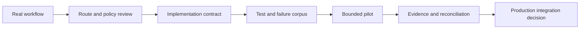

# Start with one settlement outcome

The current public entry is a **design-partner integration**, not a self-service SDK installation.

Bring one real workflow that already needs value to move and close correctly. Examples include:

- a marketplace payout;
- a creator or media payment;
- an embedded-wallet transfer;
- an application fee or deposit;
- a treasury instruction;
- an agent or x402-compatible payment flow.

## Define the outcome

A useful integration brief answers:

| Field | Required decision |
|---|---|
| **Payer and recipient** | Which actors are involved, and under whose authority? |
| **Asset and amount** | Which settlement asset and amount semantics apply? |
| **Source and destination** | Which exact rail and environment are required? |
| **Fee policy** | Which protocol, provider, partner, or minimum fees may apply? |
| **Gas policy** | Is gas sponsored, recovered, quoted separately, or user-paid? |
| **Finality requirement** | Which state counts as accepted completion? |
| **Failure policy** | Which retries, refunds, recovery, or escalation paths are allowed? |
| **Evidence** | Which receipt and ledger record close the workflow? |
| **Volume and limits** | What recurring volume, maximum, minimum, and capacity are required? |
| **Production decision** | What must be proven before the integration is accepted? |

## Integration sequence

### 1. Route and policy review

SW4P confirms whether an admitted route can support the asset, environment, amount, fee, gas, finality, and recovery requirements.

### 2. Implementation contract

The team freezes the exact request, response, authorization, idempotency, status, webhook, error, and evidence semantics for the pilot.

### 3. Test and failure corpus

The integration must prove both the successful path and the important failure states:

- invalid or expired authorization;
- insufficient balance or capacity;
- duplicate submission;
- route rejection;
- source execution without destination completion;
- timeout or stalled attestation;
- recovery or refund;
- reconciliation mismatch.

### 4. Bounded pilot

The pilot uses explicit limits, environment, counterparties, capital, and stop conditions.

### 5. Evidence and production decision

The pilot ends with a finished settlement record, not only a transaction hash. The partner and RNDRNTWRK decide whether to expand, revise, or stop the route.

## Developer contract status

<Warning>
The previous public docs contained unverified package names, API-key formats, endpoint paths, rate limits, and code examples. They have been removed from the current public navigation. Do not build against historical examples or copied snippets.
</Warning>

The authoritative developer contract will be generated from the accepted implementation and published only after:

1. interface and authentication review;
2. route and environment admission;
3. typed schema generation;
4. failure and recovery verification;
5. example compilation and execution;
6. public versioning and deprecation policy.

<CardGroup cols={2}>
  <Card title="Understand route state" icon="diagram-project" href="/supported-chains">
    Review the fields and gates required by the public route registry.
  </Card>
  <Card title="Propose an integration" icon="handshake" href="https://www.rndrntwrk.com/partners">
    Bring one live settlement workflow and the production decision it needs to reach.
  </Card>
</CardGroup>
