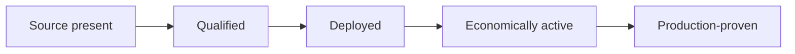

# Route availability is generated, not narrated

SW4P does not publish one evergreen list of “supported chains.”

A route is a specific economic and technical corridor involving:

- source rail and asset;
- destination rail and asset;
- environment;
- executor or adapter;
- authorization model;
- fee and gas policy;
- limits and capacity;
- liquidity or inventory dependency;
- finality and proof;
- recovery and refund rules.

Two chains may both be integrated while a particular route between them remains disabled.

## Route-state dimensions

| Dimension | Question |
|---|---|
| **Source state** | Does the executor, programme, adapter, or specification exist? |
| **Qualification state** | Has the route passed its required simulation, authorization, invariant, and workload checks? |
| **Deployment state** | Are the correct contracts, programmes, roles, and bindings deployed in this environment? |
| **Economic-activation state** | Are gas, fees, liquidity, inventory, and operating policy funded and enabled? |
| **Production-proof state** | Does a current accepted settlement and reconciliation record exist? |



<Warning>
A route may not skip from `SOURCE_PRESENT` to a public `LIVE` label. Route admission is route-local, asset-local, environment-local, and versioned.
</Warning>

## Public route registry fields

The generated route table should expose:

| Field | Example meaning |
|---|---|
| Route ID | Stable machine identifier for the exact corridor |
| Source | Chain, network, asset, and token contract or mint |
| Destination | Chain, network, asset, and token contract or mint |
| Route kind | CCTP, NTT, same-chain, partner adapter, or another admitted rail |
| Environment | Testnet, staging, limited production, or production |
| State | Separate source, qualification, deployment, activation, and proof values |
| Minimum and maximum | Current transaction bounds |
| Capacity | Available route or inventory capacity where applicable |
| Fee policy | Protocol, provider, forwarding, and minimum-fee treatment |
| Gas policy | Sponsored, recovered, quoted separately, or user-paid |
| Finality | Required route-local finality state |
| Recovery | Timeout, retry, refund, or operator escalation path |
| Last proof | Date, transaction, evidence packet, and reconciliation reference |
| Policy version | The signed route and economic policy currently in force |

## Programmatic discovery

Applications should discover supported routes from the current generated API or SDK rather than copying a documentation table into product code.

The following is a **conceptual contract**, not a promise of the current endpoint path or SDK property names:

```json
{
  "route_id": "route-specific-identifier",
  "source": { "rail": "BASE", "asset": "USDC" },
  "destination": { "rail": "SOLANA", "asset": "USDC" },
  "environment": "production",
  "source_state": "PRESENT",
  "qualification_state": "QUALIFIED",
  "deployment_state": "DEPLOYED",
  "economic_activation_state": "ENABLED",
  "production_proof_state": "ADMITTED",
  "limits": { "minimum": "registry-value", "maximum": "registry-value" },
  "fee_policy_version": "signed-policy-version",
  "last_proof": "evidence-reference"
}
```

<Info>
The generated API reference owns the actual endpoint, field names, enum values, and SDK types. Integrators should compile against that reference rather than this illustrative shape.
</Info>

## Limits

Minimums, maximums, daily limits, liquidity capacity, rate limits, and route availability are policy and environment values.

They must be:

- returned by the quote or discovery interface;
- dated and versioned;
- applied before authorization;
- revalidated immediately before execution where required;
- omitted from evergreen marketing copy.

## Routes under development

A planned or source-complete route may be listed in a research or development register only when its status is explicit.

Do not present future chains or assets as “coming soon” without:

- a defined customer or integration reason;
- a named owner;
- an accepted route architecture;
- deployment and operating requirements;
- funding for route-specific costs and capital;
- a public activation decision.

## Current source of truth

Until the generated public route registry is connected, treat the current API discovery response and admitted settlement evidence as the operating authority.

<Card title="Settlement lifecycle" icon="arrows-rotate" href="/">
  Return to the SW4P introduction to see how route discovery fits into the complete settlement outcome.
</Card>
